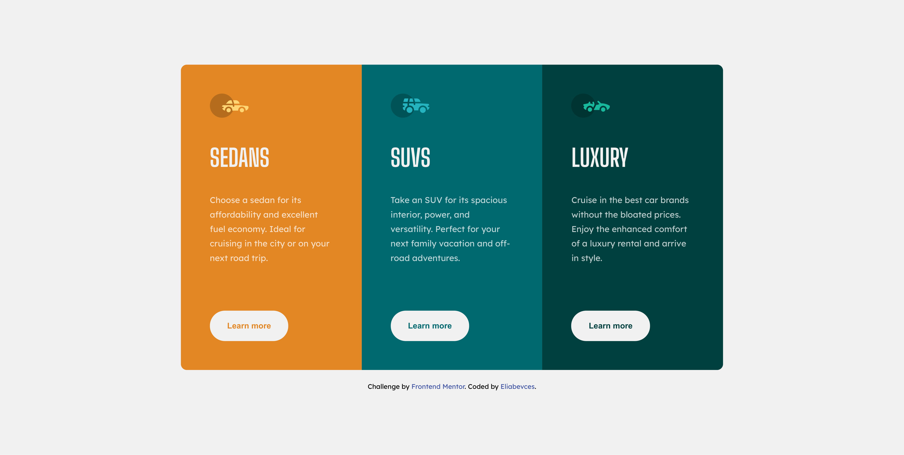

# Frontend Mentor - 3-column preview card component solution

This is a solution to the [3-column preview card component challenge on Frontend Mentor](https://www.frontendmentor.io/challenges/3column-preview-card-component-pH92eAR2-). Frontend Mentor challenges help you improve your coding skills by building realistic projects. 

## Table of contents

- [Overview](#overview)
  - [The challenge](#the-challenge)
  - [Screenshot](#screenshot)
  - [Links](#links)
- [My process](#my-process)
  - [Built with](#built-with)
  - [What I learned](#what-i-learned)
  - [Continued development](#continued-development)
- [Author](#author)
- [Acknowledgments](#acknowledgments)


## Overview

### The challenge

Users should be able to:

- View the optimal layout depending on their device's screen size
- See hover states for interactive elements

### Screenshot



### Links

- Solution URL: [Add solution URL here](https://your-solution-url.com)
- Live Site URL: [Add live site URL here](https://your-live-site-url.com)

## My process

### Built with

- HTML5
- CSS


### What I learned

In this challenge i learned a little bit more about css properties such as grid, alignments and discovered the @media rule.

Here are some snippets:

```css
main {
    width: 60vw;
    display: grid;
    grid-template-columns: 1fr 1fr 1fr;
    padding: 0;
    border-radius: 10px;
    overflow: hidden;
}
```

```css
@media screen and (max-width: 1000px) {
    body {
        width: 100vw;
        height: 100%;
        margin: 20px 0;
    }
    main {
        display: grid;
        grid-template-columns: 1fr;
        grid-template-rows: 1fr 1fr 1fr;
        width: 80vw;
        height: 900%;
    }
}
```

### Continued development

I'm going to start more challenges like this, so i can learn more about the front-end web development.
When i get some confidence in css i will start going deeper in the JavaScript language.

## Author

- Frontend Mentor - [@eliabevces](https://www.frontendmentor.io/profile/eliabevces)
- Linkedin - [Eliabe Vinicius](https://www.linkedin.com/in/eliabe-vinicius-211224177/)


## Acknowledgments

Big thanks to my buddies on discord:

- [Erick Oliveira](https://github.com/Erick-Oliveira-ET)
- [Iuri Reis](https://github.com/ooiuri)
- [Arthur Reis](https://github.com/ThurzinRB)
- [Paulo Victor](https://github.com/Matreud)

